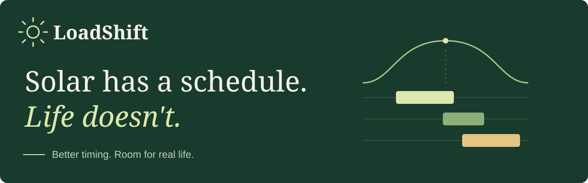
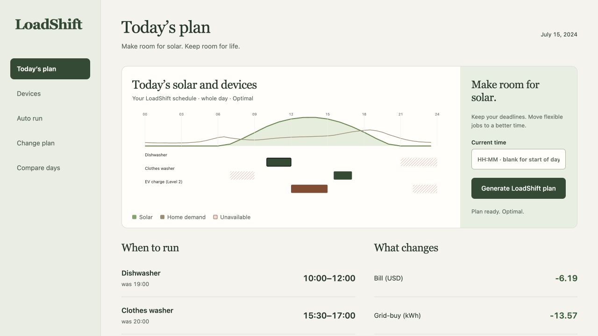
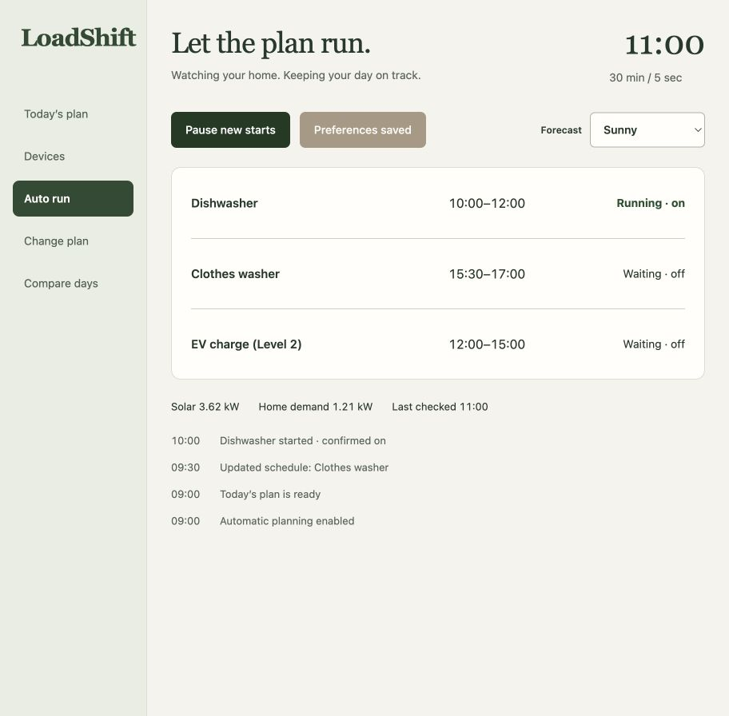
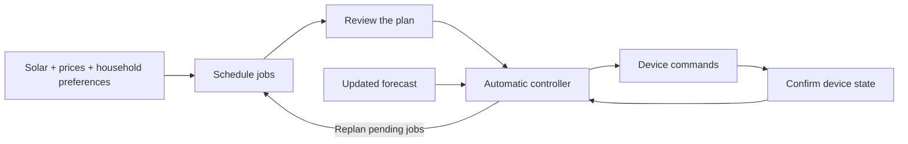

<p align="center">
  
</p>

<p align="center">
  A household energy planner that turns solar, electricity prices and your availability into a plan your devices can follow.
</p>

<p align="center">
  <a href="https://loadshift-theta.vercel.app"><strong>Try LoadShift</strong></a> ·
  <a href="https://youtu.be/cglfkZVU4nE">Demo film · 3:04</a> ·
  <a href="#quick-start">Run locally</a> ·
  <a href="docs/HOME_ASSISTANT.md">Connect your home</a>
</p>

<p align="center"><sub>Built for NextStep Hacks 2026 · Earth Forward</sub></p>



## Energy planning that leaves room for life

The dishwasher can wait for solar. Dinner cannot. LoadShift schedules flexible jobs around the times that work for your household, then helps you keep the plan useful when the day changes.

- **Plan the day.** Find uninterrupted run windows around solar, electricity prices, deadlines and unavailable times.
- **Change your mind.** Move a job, keep earlier restrictions, and see the cost of the change before committing.
- **Follow through.** Replan pending jobs as forecasts change, confirm device starts and stops, and preserve jobs already running.
- **Stay in control.** Pause new starts without interrupting current jobs. Recover saved preferences and execution progress after a restart.
- **Compare the outcome.** See estimated bill, grid use and solar self-consumption, then compare your preferences across 14 days.

The preset home includes a dishwasher, clothes washer and EV charger. Edit their power, duration and availability in **Devices**.

## Take it for a spin

[Open the live app](https://loadshift-theta.vercel.app). No account, API key or installation needed.

1. In **Today’s plan**, select **Generate LoadShift plan** to see when each job should run.
2. In **Change plan**, make **11:00–14:00** unavailable for the dishwasher. Select **Replan and show cost of change** to review the revised schedule.
3. In **Auto run**, select **Start automatic day** to run that plan. Choose **Midday clouds** to watch pending jobs adapt to the new forecast.
4. **Pause new starts**, then **Resume**. Running jobs retain their finish times. For later edits, use **Apply edited preferences** in Auto run.
5. Open **Compare days** to evaluate the same preferences across a complete two-week window.

[Download the demo film](https://github.com/Yun-0000/Loadshift/raw/refs/heads/main/artifacts/loadshift-demo.mp4) · 1080p · 60 fps · approximately 12 MB.

<details>
<summary><strong>See automatic operation</strong></summary>



The activity log follows each schedule update and device command. A start or stop is confirmed only after the device reports the expected state.

</details>

## Quick start

Use **Python 3.12** and [uv](https://docs.astral.sh/uv/getting-started/installation/). The frontend is served by Python; no frontend build or Node.js installation is needed to run the app.

```sh
git clone https://github.com/Yun-0000/Loadshift.git
cd Loadshift
uv sync --frozen
uv run loadshift serve --port 8000
```

Open **http://127.0.0.1:8000**. The included forecasts and preset devices work out of the box. Dependencies are pinned in `uv.lock`.

macOS is tested, and CI runs on Linux. On Windows, use WSL. To use another port, change `--port 8000`.

### Choose how to run

| Mode | Setup | How it runs |
| --- | --- | --- |
| **Hosted experience** | Open the live app | Each browser has its own saved demo session. The home clock advances while the page polls. |
| **Local demo** | Run the commands above | A background controller advances the home by 30 minutes every five seconds; progress is saved locally. |
| **Connected home** | Add a Home Assistant configuration | Reads your forecasts and sensors, runs on the home’s clock, and sends commands to mapped devices. |

To connect Home Assistant, provide its URL, access token, solar and base-load sensors, a forecast entity and a device mapping. Run one local server with a persistent state file. The [connection guide](docs/HOME_ASSISTANT.md) includes the configuration, expected inputs and recovery behavior; start from [the example configuration](examples/home-assistant.json).

## How it works



The planner uses half-hour slots and continuous job windows. The controller updates the remaining schedule while keeping running and completed jobs fixed. Device control uses Home Assistant on/off services with state readback; the execution journal supports recovery after a server restart.

| Layer | Technology | Role |
| --- | --- | --- |
| Interface | HTML, CSS, JavaScript | Five focused views for planning, devices, changes, automatic operation and comparison |
| API | Python, FastAPI, Pydantic | Requests, validation and shared planning context |
| Scheduling | CVXPY, HiGHS, NumPy, pandas | Constrained scheduling and energy accounting |
| Home connection | Home Assistant REST API | Forecasts, sensor readings, device commands and state confirmation |
| State | Local JSON journal / signed session cookie | Persistent local execution / isolated hosted demo sessions |
| Hosting | Vercel | Python API and web interface |

## Project guide

| Path | What lives here |
| --- | --- |
| [`web/`](web/) | Browser interface, styles and interaction logic |
| [`src/loadshift/`](src/loadshift/) | Planner, replanning, energy accounting, controller and API |
| [`api/`](api/) | Vercel entrypoint |
| [`fixtures/`](fixtures/) | Forecast snapshots, preset jobs and data sources |
| [`examples/`](examples/) | Home Assistant configuration example |
| [`tests/`](tests/) | Behavior regressions and frontend smoke checks |
| [`scripts/`](scripts/) | Reproducible scenario evaluation |
| [`artifacts/`](artifacts/) | Evaluation results and the demo film |

[Home Assistant setup](docs/HOME_ASSISTANT.md) · [Deployment](docs/DEPLOYMENT.md) · [Tests and evaluation](docs/VALIDATION.md)

## Development and checks

Install the test dependencies, then run the backend and frontend checks. **Node.js 22** is needed only for the frontend smoke check.

```sh
uv sync --frozen --extra test
uv run pytest
npm test
```

You can also run the planner without the browser:

```sh
uv run loadshift plan
uv run loadshift replan --task dishwasher --from 11:00 --to 14:00
uv run loadshift compare
```

To regenerate all four scenarios across 14 days:

```sh
uv run python scripts/evaluate_scenarios.py
```

<details>
<summary><strong>Evaluation data and testing scope</strong></summary>

The default modeled household saves a median **$6.18/day versus its original evening routine** across July 8–21, 2024. Against a tariff-aware greedy planner, the median difference is **$0.00**: 13 ties and one $0.08 improvement. The product’s emphasis is the complete planning, adjustment and execution workflow.

Weather comes from the Open-Meteo historical Los Angeles archive. Household demand, solar conversion and tariffs are modeled inputs, documented in [`fixtures/provenance.json`](fixtures/provenance.json). The estimates and all 56 scenario-days are available in [`artifacts/evaluation.json`](artifacts/evaluation.json).

Automated browser testing covered 19 tasks. Home Assistant testing used three virtual switches, authenticated service calls and state readbacks. Regression coverage includes saved preferences, outdated edits, forecast consistency, day rollover, restart recovery and isolated hosted sessions. See the [validation guide](docs/VALIDATION.md) for methods and reproduction commands.

</details>

## Feedback and contributions

[Report a problem](https://github.com/Yun-0000/Loadshift/issues/new) with the view you used, steps to reproduce it, and the expected result. For a code change, keep the scope focused and run the checks above. Keep tokens, local state and personal device details out of commits and issue reports.

## License

[MIT](LICENSE). Copyright and permission notices are included in the license file.
