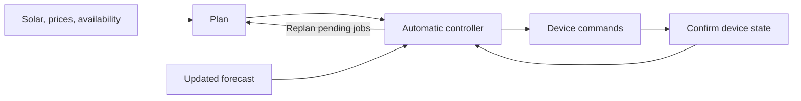

# Development

LoadShift serves its frontend through Python; no frontend build is needed. Use Python 3.12 and uv. macOS is tested, CI runs on Linux, and Windows users should use WSL.

## Checks

Node.js 22 is needed for the frontend checks only.

```sh
uv sync --frozen --extra test
uv run pytest
npm test
```

Keep changes focused and run these checks before contributing. Include the affected view, reproduction steps and expected behavior in issue reports. Keep credentials and personal device configuration out of commits.

## Command-line tools

```sh
uv run loadshift plan
uv run loadshift replan --task dishwasher --from 11:00 --to 14:00
uv run loadshift compare
uv run python scripts/evaluate_scenarios.py
```

The last command regenerates four household scenarios across 14 days. [Evaluation methods and results](VALIDATION.md).

## Runtime

| Mode | Behavior |
| --- | --- |
| Hosted sample home | Isolated browser sessions; the clock advances during visible polling. |
| Local sample home | Background controller advances 30 minutes every five seconds and saves progress locally. |
| Connected home | Reads Home Assistant forecasts and sensors, uses the home's clock, and sends mapped device commands. |

The planner uses half-hour slots and uninterrupted job windows. The controller updates pending jobs while preserving running and completed jobs. Home Assistant commands are confirmed through state readback; a local execution journal supports restart recovery.



## Source map

- `src/loadshift/`: API, scheduling, energy accounting and controller.
- `web/`: interface and browser interactions; `api/`: Vercel entrypoint.
- `fixtures/`: forecast snapshots, default jobs and data sources.
- `examples/`: Home Assistant configuration; `tests/`: regression checks.
- `scripts/`: scenario evaluation; `artifacts/`: results and final video.

[Automatic operation screenshot](images/auto-run.png) · [Download the demo film](../artifacts/loadshift-demo.mp4)
